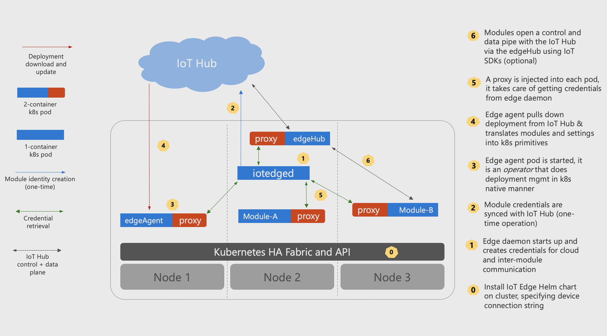

# IoT Edge workloads on Kubernetes

IoT Edge integration with Kubernetes enables users to deploy an Azure IoT Edge workload to a Kubernetes cluster on premises. With this new integration, customers can use the feature-rich and resilient infrastructure layer that Kubernetes provides to run their Azure IoT Edge workloads, which are managed centrally and securely from Azure IoT Hub. 

IoT Edge registers a Custom Resource Definition (CRD) with the Kubernetes API Server. Additionally, it provides an Operator (IoT Edge agent) that reconciles cloud-managed desired state with the local cluster state.

Module lifetime is managed by the Kubernetes scheduler, which maintains module availability and chooses their placement. IoT Edge manages the edge application platform running on top, continuously reconciling the desired state specified in IoT Hub with the state on the edge cluster. The edge application model is still the familiar model based on IoT Edge modules and routes. The IoT Edge agent operator performs automatic translation to the Kubernetes natives constructs like pods, deployments, services etc.

Here is a high-level architecture diagram: 



Every component of the edge deployment is scoped to a Kubernetes namespace specific to the device, making it possible to share the same cluster resources among multiple edge devices and their deployments.

## Using IoT Edge as a gateway for downstream devices 

The edge device in a Kubernetes cluster can be used as an [IoT gateway for downstream devices](https://docs.microsoft.com/azure/iot-edge/iot-edge-as-gateway). It can be deployed on Kubernetes in a manner resilient to node failure thus providing high availability to edge deployments. 

There are three additional Kubernetes components external to IoT Edge we'll need to leverage to enable this scenario:

* A network load balancer to provide a stable IP address or DNS name to access services in the edge deployment. Cloud providers leverage their specific technologies to provide this functionality out of the box. However, it is bit more challenging in on-prem environments. [Here](https://github.com/ramitsurana/awesome-kubernetes#load-balancing) is a non-definitive list of possible options. We have tested with [metalLB](https://metallb.universe.tf/) which might be a good on-prem option if your Kubernetes provider or distribution comes up short.

* A [StorageClass](https://kubernetes.io/docs/concepts/storage/storage-classes/) provisioner with support for [persistent volumes](https://kubernetes.io/docs/concepts/storage/persistent-volumes/). This is leveraged by edge daemon pod to store module credential information which can be persisted across nodes should the pod be reinitialized on a different node. This facility can be used by other edge modules as well (for e.g. Edge Hub) to persistent data in a Kubernetes environment. Here is a [list](https://github.com/ramitsurana/awesome-kubernetes#persistent-volume-providers) of possible options.

* An ingress controller, to route external traffic to different service endpoints exposed by the edge deployment. While not strictly required, an ingress controller provides useful features like TLS termination, exposing multiple services behind a single IP address (or host name) and integration with public certificate authorities like [Lets Encrypt](https://letsencrypt.org/). There are a number of [options](https://github.com/ramitsurana/awesome-kubernetes#load-balancing) in this space, we  tested with [Voyager](https://github.com/appscode/voyager) which provides good support for non-HTTP TCP based protocols like MQTTS and AMQP.

## Prerequisites

In this example setup we'll use the following components:

* [Azure Kubernetes Service](https://docs.microsoft.com/azure/aks/) (AKS) for a hosted Kubernetes environment
* [Helm](https://helm.sh/), to install applications into the cluster
* The Kubernetes command-line tool, [kubectl](https://kubernetes.io/docs/tasks/tools/install-kubectl/), to run commands against the cluster
* [Docker Desktop](https://docs.docker.com/install/#supported-platforms) to run a simulated downstream device 
* [Voyager](https://appscode.com/products/voyager/) (v10.0.0), a HAProxy based ingress controller
* [mkcert](https://mkcert.dev), a simple tool for creating development TLS certificates

## Basic basic transparent gateway setup  

**Note: this setup is for testing only**


1. [Create an AKS cluster](https://docs.microsoft.com/azure/aks/kubernetes-walkthrough?view=azure-cli-latest#create-aks-cluster) and [connect to it](https://docs.microsoft.com/azure/aks/kubernetes-walkthrough?view=azure-cli-latest#connect-to-the-cluster). 
    >   Use `--node-count 2` in the `az aks create` command to test high availability.


1. [Create an Azure File storage class](https://docs.microsoft.com/azure/aks/azure-files-dynamic-pv#create-a-storage-class), [a cluster role and binding](https://docs.microsoft.com/azure/aks/azure-files-dynamic-pv#create-a-cluster-role-and-binding), and [a persistent volume claim](https://docs.microsoft.com/azure/aks/azure-files-dynamic-pv#create-a-persistent-volume-claim).


1. Initialize `helm` by [creating a service account](https://docs.microsoft.com/azure/aks/kubernetes-helm#create-a-service-account) and configuring it with the basic initialization step:

    ```shell
    helm init --service-account tiller
    ```

1. [Create an IoT Hub](https://docs.microsoft.com/en-us/azure/iot-hub/iot-hub-create-through-portal#create-an-iot-hub), [register an IoT Edge device](https://docs.microsoft.com/en-us/azure/iot-edge/how-to-register-device-cli), and note its connection string.

1. Helm install `iotedged` and `edgeagent` into your cluster, specifying the device connection string and the persistent volume claim we created previously. For example:

    ```shell
    helm install \
    --name k8s-gw \
    --set "deviceConnectionString=replace-with-edge-device-connection-string" \
    --set "iotedged.data.persistentVolumeClaim.name=azurefile" \
    --set "iotedged.data.persistentVolumeClaim.storageClassName=azurefile" \
    --set "edgeAgent.env.portMappingServiceType=LoadBalancer" \
    edgek8s/edge-kubernetes
    ```

    Resources for the device will be created under a namespace with naming convention `msiot-<hub_name>-<device_name>`

1. Note the external IP address of the `edgehub` service using the following command (it can take a few minutes for the external IP to be assigned)

    ```shell
    kubectl get service --all-namespaces
    ```

1. To test the IoT Edge gateway, create a IoT device (non-edge) in the same IoT Hub as the device. Note the IoT device's connection string and use it in the following command.

    ```shell
    docker run \
    -e DEVCONSTR="replace-with-non-edge-iot-device-connection-string;GatewayHostName=edgehub-external-ip-from-previous-step" \
    veyalla/sample-client
    ```

    You should see the sample client successfully connecting, and ingesting sample data in to IoT Hub via the edge device!

    ```shell
    $ docker run \
        -e DEVCONSTR="xxxxxxxxx;GatewayHostName=a.b.c.d" \
        veyalla/sample-client:latest

    Connection Status Changed to Connected
    Connection Status Changed Reason is Connection_Ok

    Device sending 5000 messages to IoTHub with delay 3000 ms

            05/03/2019 21:55:59> Sending message: 0, Data: [{"messageId":0,"temperature":20,"humidity":74}]
            05/03/2019 21:56:03> Sending message: 1, Data: [{"messageId":1,"tempey rature":29,"humidity":75}]
    ```

    >The sample client disables TLS server validation, something you shouldn't do in production.

## Exposing edge services via a Kubernetes ingress

There are advantages to exposing an edge deployment's services through an ingress controller:

* If multiple edge modules expose an services, with the basic setup they would be assigned different IP addresses. An ingress helps expose these from a single IP or hostname on different ports.

* TLS connections can be terminated at the ingress point, allowing use of a single server certificate for all services exposed by the edge deployment. For publicly accessible domain names, integration with globally trusted certificate authorities also becomes viable.

We'll use [Voyager](https://github.com/appscode/voyager), a open source ingress controller based on HAProxy that has good support for non-HTTP TCP services.

1. If you have the basic gateway set up using the previous section's instructions, delete it using the command below. Deletion can take a minute or two, check for completion by confirming the device namespace is gone.

    ```shell
    helm delete --purge k8s-gw
    ```

1. If you've not already, follow the steps until, but not including `helm install ...` from the previous section. Then deploy the edge device into the cluster without specifying the `LoadBalancer` service type.

    ```shell
    helm install \
    --name k8s-gw \
    --set "deviceConnectionString=replace-with-edge-device-connection-string" \
    --set "iotedged.data.persistentVolumeClaim.name=azurefile" \
    --set "iotedged.data.persistentVolumeClaim.storageClassName=azurefile" \
    edgek8s/edge-kubernetes
    ```

    This creates Kubernetes services of type `ClusterIP` when translating the edge deployment.

1. Helm install the Voyager ingress controller into the cluster using these steps:

    ```shell
    helm repo add appscode https://charts.appscode.com/stable/

    helm repo update

    helm install appscode/voyager --name voyager-operator --version 10.0.0 \
    --namespace kube-system \
    --set cloudProvider=aks
    ```
